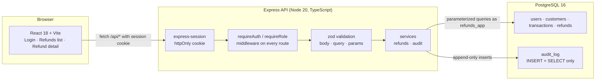

# Refunds Review Dashboard

A refunds review tool for a fintech operations team: a React frontend, an
Express API and PostgreSQL. Refunds are raised by agents, reviewed by approvers
under a maker-checker rule, and every state change is written to an append-only
audit log.

- Server-side pagination and filtering (date range, amount range, reason,
  status) over ~200 seeded refunds.
- Refund detail page with the customer's transaction history and an audit
  timeline.
- Approve / reject actions that require a comment.
- Three roles (`viewer`, `agent`, `approver`) enforced in Express middleware on
  every route.
- Append-only `audit_log`, enforced by database grants and a trigger as well as
  by the application.

## Quick start

Requirements: Node 20+, Docker (for PostgreSQL), npm 10+.

```bash
git clone <this repo> && cd Cognition-AI-Project
cp .env.example .env          # defaults match docker-compose.yml
npm install                   # installs both workspaces
npm run db:up                 # starts PostgreSQL 16 on localhost:5432
npm run migrate               # applies server/db/schema.sql
npm run seed                  # 3 users, 40 customers, ~600 transactions, 200 refunds
npm run dev                   # API on :3001, web on :5173
```

Open http://localhost:5173 and sign in with one of the seeded accounts. The
password for all three is the `SEED_PASSWORD` value in `.env`
(`Password123!` by default).

| Email | Role | Can do |
| --- | --- | --- |
| `viewer@example.com` | viewer | Read refunds, detail, audit trail |
| `agent@example.com` | agent | Everything a viewer can, plus raise refunds |
| `approver@example.com` | approver | Everything an agent can, plus approve/reject refunds they did not raise |

Other commands:

```bash
npm test         # API integration tests (re-migrates and re-seeds the database)
npm run lint     # ESLint across both workspaces
npm run typecheck
npm run build
```

`npm test` rewrites the contents of the database named in `DATABASE_URL`; point
it at a scratch database if that matters to you.

If you would rather not use Docker, install PostgreSQL 16 locally, create a
`refunds` database, and set `ADMIN_DATABASE_URL` to a superuser connection for
that database. The migration creates the restricted `refunds_app` login role
that `DATABASE_URL` uses.

## Architecture



Request path for a decision (`POST /api/refunds/:id/approve`):

1. `requireAuth` rejects anonymous requests (401).
2. `requireRole('approver')` rejects insufficient roles (403).
3. `validate` parses the id and the comment; anything unexpected is a 400.
4. Inside one transaction: `SELECT ... FOR UPDATE` the refund, refuse if the
   actor created it (maker-checker) or if it is no longer pending (409), update
   the refund, insert the `audit_log` row, commit.

### Layout

```
server/
  db/schema.sql       tables, indexes, append-only trigger, role grants
  db/migrate.ts       applies schema.sql (idempotent)
  db/seed.ts          deterministic seed data
  src/app.ts          express wiring and middleware order
  src/middleware/     auth (RBAC), validate (zod), errors
  src/routes/         auth.ts, refunds.ts
  src/services/       refunds.ts (queries, transactions), audit.ts (the only writer)
  src/validators.ts   every accepted input shape
  tests/api.test.ts   integration tests against a real database
web/
  src/pages/          LoginPage, RefundsListPage, RefundDetailPage
  src/components/     FiltersBar, Pagination, StatusBadge, AuditTimeline, dialogs
  src/api.ts          fetch wrapper, query-string building
```

## API

All routes are under `/api`. Every route below requires a session; the role
column is the minimum role, and roles are ranked `viewer < agent < approver`.

| Method | Path | Role | Notes |
| --- | --- | --- | --- |
| POST | `/auth/login` | — | Sets the session cookie, writes an `auth.login` audit row |
| POST | `/auth/logout` | any | |
| GET | `/auth/me` | any | Current user |
| GET | `/refunds` | viewer | `page`, `pageSize` (≤100), `dateFrom`, `dateTo`, `amountMin`, `amountMax`, repeated `reason`, repeated `status`, `sort`, `order` |
| GET | `/refunds/:id` | viewer | Refund, masked customer, audit timeline |
| GET | `/refunds/:id/transactions` | viewer | The customer's transaction history, paginated |
| POST | `/refunds` | agent | `transactionId`, `amountCents`, `reason`, optional `note` |
| POST | `/refunds/:id/approve` | approver | `comment` (10–1000 chars), maker-checker enforced |
| POST | `/refunds/:id/reject` | approver | Same rules as approve |

Amounts are integer cents everywhere in the API. Unknown query parameters and
out-of-range values are rejected with a 400 and a field-level error list rather
than being silently ignored.

## Schema

```
users(id, email unique, name, role, password_hash, created_at)
customers(id, name, email, account_number_last4, created_at)
transactions(id, customer_id → customers, amount_cents, currency, description,
             occurred_at, created_at)
refunds(id, customer_id → customers, transaction_id → transactions, amount_cents,
        currency, reason, status, note, created_by → users, created_at,
        decided_by → users, decided_at, decision_comment)
audit_log(id, actor_user_id → users, action, refund_id → refunds, old_status,
          new_status, comment, ip, created_at)
```

- `role` ∈ `viewer | agent | approver`
- `reason` ∈ `duplicate | fraud | customer_request | processing_error | subscription_cancellation`
- `status` ∈ `pending | approved | rejected`
- A `refunds` check constraint keeps decided rows complete: a non-pending refund
  always has `decided_by`, `decided_at` and `decision_comment`.
- Indexes support the list filters: `status`, `reason`, `created_at`,
  `amount_cents`, `customer_id`, and `(refund_id, created_at)` on `audit_log`.

## Security model

**Authorisation.** `requireAuth` is mounted on the whole `/api` surface after
the auth routes, and each refunds route additionally declares the minimum role.
A route added without its own role check still cannot be reached anonymously.
The frontend hides and disables actions the current user cannot perform, but
that is presentation only — every check is repeated on the server.

**Maker-checker.** `decideRefund` refuses when `created_by` equals the actor,
and the `UPDATE` itself carries `AND created_by <> $actor`, so the rule holds
even if the service-level check were bypassed. Agents and approvers can both
raise refunds; nobody can decide their own.

**Append-only audit.** Three independent layers:

1. `recordAudit` is the only function that writes to `audit_log`, and it only
   inserts.
2. The API connects as `refunds_app`, which is granted `SELECT, INSERT` on
   `audit_log` and explicitly revoked `UPDATE, DELETE, TRUNCATE`.
3. A `BEFORE UPDATE OR DELETE` trigger raises an exception, so even a superuser
   session cannot quietly amend history.

Audit rows are written for logins, logouts, refund creation and every decision,
each with actor, action, refund id, old and new status, comment, client IP and
timestamp. The IP comes from the socket unless `TRUST_PROXY` is set to the
number of reverse proxy hops in front of the API, so a client cannot choose the
address recorded against it by sending `X-Forwarded-For`.

**Refund amounts.** Creating a refund locks the transaction row and sums the
non-rejected refunds already raised against it, so a payment cannot be refunded
for more than it was worth, even under concurrent requests.

**Injection.** Every query is parameterized; filters are assembled as `$n`
placeholders and the only interpolated fragment is the sort column, taken from
a fixed whitelist.

**Input validation.** zod schemas cover every body, query and route parameter,
with `.strict()` so unknown fields are rejected. Amounts are bounded integers,
dates must parse, enums must match, and page sizes are capped at 100.

**Account numbers.** Only the last four digits are stored, so there is no full
account number in the database to leak. The API returns them pre-masked
(`••••1234`).

**Sessions.** httpOnly, `sameSite=lax`, `secure` in production, 8 hour expiry,
regenerated on login to prevent session fixation. Login compares against a
dummy hash for unknown emails so timing does not reveal which accounts exist.

## Known limitations

- Sessions are held in the default in-memory store, so restarting the API logs
  everyone out and the API cannot be run as more than one process. Use
  `connect-pg-simple` or Redis for anything real.
- No CSRF token. `sameSite=lax` plus a JSON-only API covers the common cases,
  but a state-changing form post from another origin is not defended in depth.
- No rate limiting or lockout on login, and all seeded users share a known
  development password.
- The audit log is append-only by grants and a trigger, but is not
  tamper-evident: there is no hash chain or off-box shipping, and someone with
  full database ownership could still drop the trigger.
- The refund intake form asks for a raw transaction id; a real one would search
  the customer's transactions.
- Pagination is offset-based, which is fine at this data size but drifts under
  concurrent writes.
- Amounts are stored per row with a currency column, but the UI assumes a single
  currency for totals and formatting.
- `npm test` runs against the same database as development and re-seeds it.
- No production build pipeline for deployment (containers, migrations on boot,
  secrets management) — the app is set up to be read and run locally.
